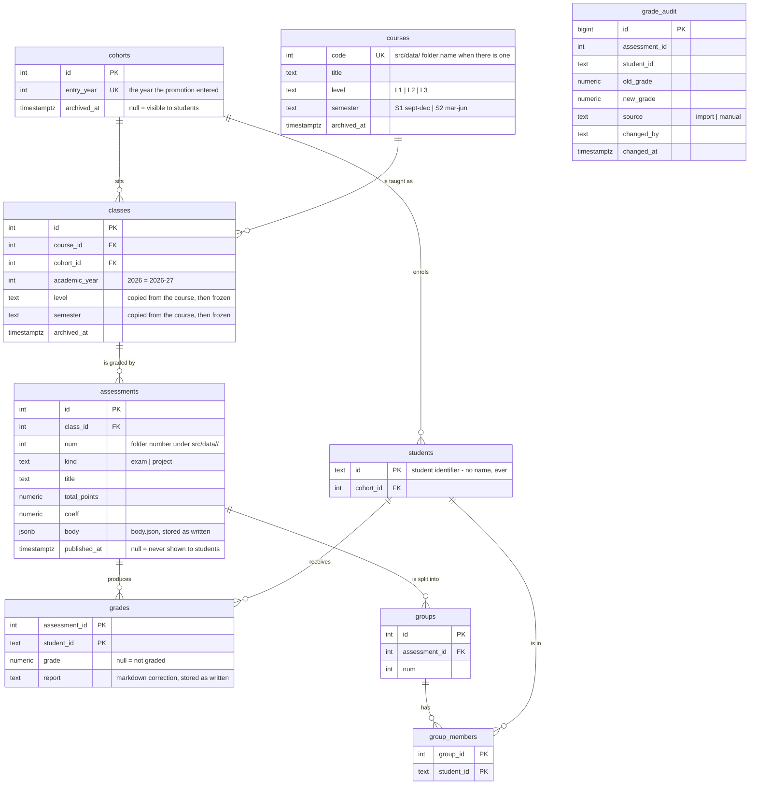

# Database

PostgreSQL, reached with the `pg` driver and plain SQL. The schema lives in
numbered migrations under `src/db/migrations/` and is applied by
`npm run migrate`; grades enter separately through `npm run import`. See
`docs/adr/0003-postgresql-access-and-migrations.md` for why, and
`docs/adr/0004-docker-compose-environments.md` for how the database is started.

## Schema

`grade_audit` is drawn apart on purpose: it carries no foreign keys, so that
deleting an assessment or a student cannot erase the record of what they were
graded.

## Three notions, not one

A **course** is the catalogue entry — what the programme teaches. A **class** is
one edition of it: a cohort taking that course in a given academic year.
Assessments and grades hang off the edition, never off the course, so
reorganising the programme cannot rewrite what a past promotion was graded on.
That is also why `level` and `semester` are copied onto the edition and frozen.

A promotion entering in year *Y* sits level *N* during academic year
*Y + N − 1*. The editions are derived from that rule rather than listed, so
adding next year's promotion is one row in `cohorts`.

## Rules the database enforces

Three things are deliberately not left to application code, because an import,
a route handler and a `psql` session are three different write paths and only
the database sees all three.

**Every grade change is journalled.** A trigger on `grades` writes to
`grade_audit` on insert, update and delete. The author and the source come from
`app.actor` and `app.source`, set with `SET LOCAL` inside the writing
transaction, so they travel with the write. The import declares itself as
`import`; anything else defaults to `manual`, and a write that declares nothing
is recorded as `unknown` rather than rejected — losing the record is worse than
not knowing who did it.

**Archiving hides, it never deletes.** `archived_at` on cohorts, courses and
editions records when something was hidden, and clearing it brings it back.

**Students read one object.** `student_grades_v` exposes grades whose
assessment is published and whose edition, course and promotions are not
archived. The student API reads that view and nothing else, so no endpoint can
forget a condition; the teacher area reads the tables and sees everything. The
view checks two promotions, the student's and the edition's: a student
repeating a year belongs to one while sitting the edition of another, and
archiving either has to hide the grade.

## What is not there yet

- **One course code no longer matches its folder.** `src/data/algo/` holds
  Data & Algorithms II, whose catalogue code is `algo2` so that it reads next
  to `algo1` and `algo3`. The import looks courses up by folder name, so adding
  that folder to `import-map.json` will stop with `no course with code "algo"`
  until the map can carry a course code alongside the promotion. It fails
  loudly rather than importing into the wrong course.
- **Group projects are not imported.** The tables exist, the import stops on a
  project folder rather than loading half of it.
- **No `variant` column.** No assessment in `src/data/` has several subjects
  (versions A/B). The day one does, the version a student received belongs on
  their row in `grades`.
- **Project-only fields are unmodelled.** `info.json` carries `startDate` and
  `deadline` for projects, and `groups.json` carries a group name, a repository
  link and comments. None of them has a column yet; they are needed when group
  import lands.
- **`date` is not stored.** `published_at` comes from `publishedDate`; the
  `date` field of `info.json` has nowhere to go for now.
